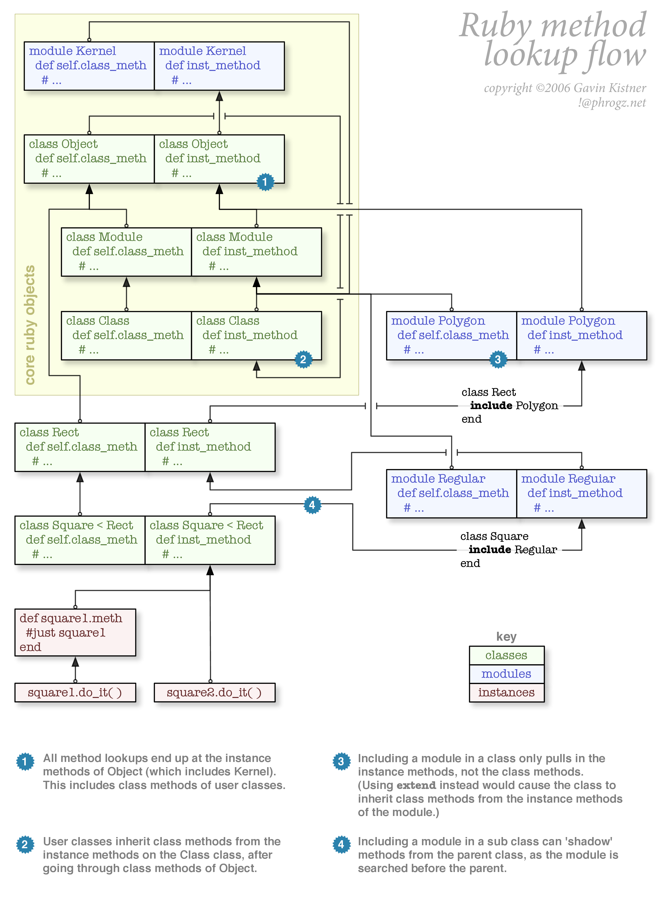

# Ruby Classes

* Any class we create itself is stored as instance of `Class`.
* That instance is referenced through a constant with **Name** of the user class

~~~ruby
class Myclass
end

# Myclass is an instance of Class
puts Myclass.class
puts Class.ancestors
puts Myclass.instance_of?(Class)

# new is the constructor
# The below call invokes new method on instance of Class called Myclass.
myclass = Myclass.new
~~~

## Initializing class

* using `initialize` method to initialize an object

~~~ruby
class Person
  def initialize(name, age)
    @name = name
    @age = age
  end

  def greet
    puts "Hello, #{@name}"
  end
end

# objects created on heap
# new calls allocate first and then calls initialize
p1 = Person.new("John", 25)

puts p1.object_id

if p1.respond_to?("greet")
  p1.greet
end
~~~

* `Object#respond_to?` - returns true if object contains the method passed.
* `ri Object#instance_of?` - `obj.instance_of(A)` returns true only when `obj` is instance of `A`.

## Garbage collection

* ruby's GC called **mark and sweep**

## Class Methods

* Sending message to the class's object rather to the class instances. Example `new` is a class method.

* Class methods cannot be accessd by instances of that class.

> A class object (like Dog) has its own methods, its own state, its own identity. It doesn't share these things with instances of itself.

## `method_missing` hook

When message sent to an object, it should contain method with name as in the message in its [method search path](./ruby_method_flow.png) .`NoMethodError` raised when no method is found for that message. If `method_missing` method is implemented on the object, instead of raising error, control is passed to that method for graceful handling.

~~~ruby
class Myclass
  def method_missing(m, *args, &block)
    puts "Missing method: #{m} on Myclass instance #{self.object_id}"
  end
end

Myclass.new.say_hello
~~~

## `defined?` keyword

* Returns a string describing its argument. returns `nil` when the argument passed to the `defined?` keyword is undefined.

~~~ruby
# defined? on classes and module names return constant
defined?(Kernel) # "constant"
defined?(Object) # "constant"

# defined? on instances return
defined?(nil) # "nil"
defined?(false) # "false"
defined?(true) # "true"

class Myclass
end

defined?(Myclass) # "constant"

c = Myclass.new
defined?(c) # "local-variable"

defined?($LOAD_PATH) # "global-variable"
defined?(1) # "expression"

def say_hello(name)
  puts "Hello, #{name}"
end

defined?(say_hello) # "method"

# when variable is undefined, this keyword returns nil
defined?(MY_CONSTANT) # nil
~~~

### `defined?` keyword and logical operators

~~~ruby
# enclosed in parathesis due to lower precedence compared to logical operators (&&, ||, !)
if defined?(words_list) && words_list.empty?
  puts "words list is empty"
end

# trying without paranthesis will be interpreted like
p defined?(words_list && words_list.empty?)
~~~

## `undef` keyword

* The undef keyword prevents the current class from responding to calls to the named methods.

~~~ruby
class Person
  def initialize(name, age)
    @name = name
    @age = age
  end

  def greet
    puts "Hello, #{@name}"
  end

  undef :greet
end

p1 = Person.new("John", 25)
p1.greet
~~~

## Class methods and class variables

* Class variables and class level methods can be accessed by the instance methods.

~~~ruby
class SimpleClass
  # class variables prefixed with @@ everywhere
  # whether inside class method or instance methods
  @@simple_class_instance_count = 0
  @instance_id = nil

  def initialize
    @@simple_class_instance_count += 1

    # instance variable always referenced with @ prefix
    @instance_id = @@simple_class_instance_count
  end

  def self.class_name
    # here self refers to the SimpleClass which itself is an instance of Class
    self.name
  end

  # only methods can be referenced via self
  # instance variables should be referenced with@
  # class variables referenced with @@
  def self.print_instance_count
    # using `self.simple_class_instance_count` here will throw error `NoMethodError`
    # because self doesnot have a method named simple_class_instance_count to
    # respond. simple_class_instance_count is a variable and not a method
    # only methods respond to messages
    puts "#{self.class_name} has #{@@simple_class_instance_count} instances created"
  end

  def simple_method
    puts "Current instance is Instance No: #{@instance_id} of #{SimpleClass.class_name}"
  end
end

# singletone_methods are the class methods
SimpleClass.singleton_methods(false).sort

# instance methods
SimpleClass.instance_methods(false).sort

SimpleClass.print_instance_count
simple_class = SimpleClass.new
simple_class.simple_method
~~~

**NOTE**: Use `self` inside a class method or an instance method only for invoking another class method or instance method respectively.

---

## References

* [Ruby Classes](http://rubylearning.com/satishtalim/writing_our_own_class_in_ruby.html)
* [defined? keyword](https://docs.ruby-lang.org/en/2.2.0/syntax/miscellaneous_rdoc.html)
